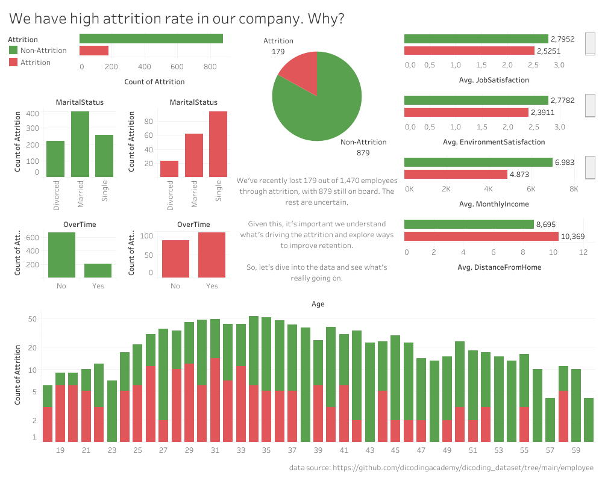

# Proyek Menyelesaikan Permasalahan HR

## Business Understanding

Sejak berdiri pada tahun 2000, sebuah perusahaan multinasional dengan lebih dari 1000 karyawan yang tersebar di berbagai wilayah mengalami tantangan serius dalam pengelolaan sumber daya manusia. Salah satu dampak paling mencolok dari permasalahan ini adalah meningkatnya attrition rate, yang saat ini telah melebihi angka 10%.

Dengan menggunakan data karyawan dari perusahaan, kita akan membantu tim HR dalam mengidentifikasi faktor-faktor utama yang berkontribusi terhadap tingginya tingkat pengunduran diri karyawan. Selain melakukan analisis mendalam terhadap data karyawan, sebuah business dashboard interaktif dikembangkan guna mempermudah manajemen dalam memantau dan memahami pola-pola yang berkaitan dengan retensi karyawan. 

### Permasalahan Bisnis

Untuk membantu HR dalam menangani tingginya angka attrition rate, pada proyek ini kita akan menggunakan data untuk menjawab pertanyaan bisnis: 

>Bagaimana cara mengetahui pola perbedaan antara karyawan yang mengundurkan diri dengan yang tidak?

### Cakupan Proyek

Membangun dashboard untuk memberikan gambaran perbedaan antara karyawan yang mengundurkan diri dengan yang tidak. 

### Persiapan

Sumber data: https://github.com/dicodingacademy/dicoding_dataset/tree/main/employee

Setup environment - Shell/Terminal:

```
mkdir proyek_attrition_problem
cd proyek_attrition_problem
pipenv install
pipenv shell
pip install -r requirements.txt
```

Run Script Prediksi Attrition - Shell/Terminal:
```
python predict.py
```

## Business Dashboard

Link dashboard (Tableau Public): https://public.tableau.com/app/profile/dina.nabila/viz/Wehavehighattritionrateinourcompany_Why/Dashboard

Link video penjelasan dashboard: https://drive.google.com/file/d/12pV18gqrtVKbScf7h6A4-n1JXxRTmHZR/view?usp=drive_link



Dashboard berisi jumlah masing-masing karyawan yang mengundurkan diri dan tidak, beserta pola yang menonjol dari sisi usia, status pernikahan, apakah lembur atau tidaknya, rata-rata pendapatan bulanan, sampai jarak rumah ke kantor.

Berdasarkan chart pada dashboard, dapat dilihat bahwa: 
- Pada rentang usia 18 sampai 30 tahun proporsi karyawan yang mengundurkan diri lebih tinggi ketimbang yang menetap di perusahaan
- Jumlah karyawan yang mengundurkan diri lebih banyak berstatus lajang, sementara yang menetap mayoritas berstatus menikah dan cerai
- Rata-rata tingkat kepuasan kerja dan lingkungan kerja karyawan yang mengundurkan diri lebih rendah dibanding karyawan yang menetap
- Rata-rata pendapatan bulanan karyawan yang mengundurkan diri lebih rendah dibandingkan yang menetap
- Rata-rata jarak kantor ke rumah karyawan yang mengundurkan diri lebih jauh daripada yang menetap

## Conclusion

Berdasarkan analisis data dan visualisasi interaktif melalui dashboard, proyek ini berhasil mengidentifikasi sejumlah pola signifikan yang membedakan karyawan yang mengundurkan diri dengan yang tetap tinggal di perusahaan. Pola-pola ini menunjukkan bahwa keputusan karyawan untuk keluar dari perusahaan tidak bersifat acak, melainkan dipengaruhi oleh faktor-faktor tertentu yang dapat diukur dan dimonitor oleh HR, seperti usia dan pendapatan bulanan karyawan.

### Rekomendasi Action Items

Berikut beberapa rekomendasi action items yang harus dilakukan perusahaan guna menyelesaikan permasalahan attrition rate yang tinggi. 


#### 🎯 1. Fokus pada Retensi Karyawan Muda (Usia 18–30 Tahun)
Masalah: Proporsi resign tinggi di kelompok usia muda.

Action Items:

- Buat program onboarding dan mentoring khusus untuk karyawan muda.

- Tawarkan jalur karier yang jelas dengan pelatihan keterampilan dan promosi yang transparan.

- Buat komunitas internal (youth network, interest groups) agar mereka merasa terhubung.

#### 💍 2. Tinjau Dukungan terhadap Karyawan Lajang
Masalah: Karyawan lajang lebih banyak yang mengundurkan diri.

Action Items:

- Evaluasi apakah ada perbedaan dalam tunjangan/benefit yang memengaruhi keputusan mereka.

- Sediakan program kesejahteraan dan sosial untuk meningkatkan engagement (misal: kegiatan komunitas, klub hobi, event internal).

#### 😊 3. Tingkatkan Kepuasan Kerja dan Lingkungan
Masalah: Kepuasan dan persepsi lingkungan kerja rendah pada karyawan yang resign.

Action Items:

- Lakukan survei kepuasan kerja secara berkala untuk menangkap masalah lebih awal.

- Terapkan program penghargaan dan pengakuan (recognition).

- Latih manajer untuk menciptakan budaya kerja positif dan mendukung.

#### 💰 4. Review Struktur Gaji dan Tunjangan
Masalah: Gaji bulanan rata-rata lebih rendah pada karyawan yang resign.

Action Items:

- Bandingkan gaji dengan standar industri, khususnya untuk posisi entry-level.

- Evaluasi apakah gaji kompetitif sudah diberikan pada posisi dengan attrition tinggi.

- Pertimbangkan tunjangan non-finansial seperti work-life balance, hybrid work, atau fasilitas tambahan.

#### 🚗 5. Perhatikan Jarak Tempuh Rumah ke Kantor
Masalah: Jarak rumah ke kantor lebih jauh pada karyawan yang resign.

Action Items:

- Tawarkan fleksibilitas kerja seperti WFH atau hybrid work arrangements.

- Berikan subsidi transportasi atau shuttle service bagi karyawan yang tinggal jauh.

- Pertimbangkan relokasi kantor satelit untuk lokasi dengan banyak karyawan.

#### 🕒 6. Tinjau Kebijakan Lembur
Tambahan jika ada info lembur: Jika karyawan yang resign lebih banyak lembur, perlu ada pengaturan.

Action Items:

- Monitor jam kerja berlebih dan pastikan kompensasi lembur yang adil.

- Promosikan keseimbangan kerja dan kehidupan pribadi (work-life balance).

- Evaluasi beban kerja untuk posisi dengan tingkat lembur tinggi.

#### 📊 7. Buat Dashboard Attrition Dinamis untuk Monitoring
Action Items:

- Update dashboard secara rutin (bulanan/kuartalan).

- Tambahkan filter berdasarkan departemen, lokasi, jabatan.

- Gunakan data tersebut untuk tindakan pencegahan lebih dini (predictive attrition analytics).
